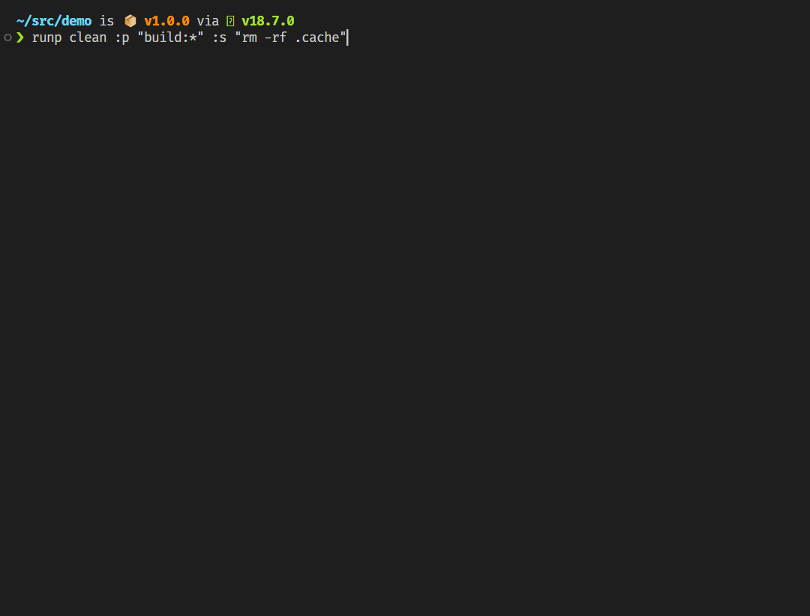
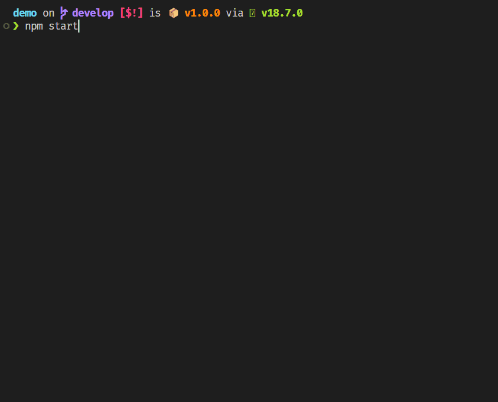
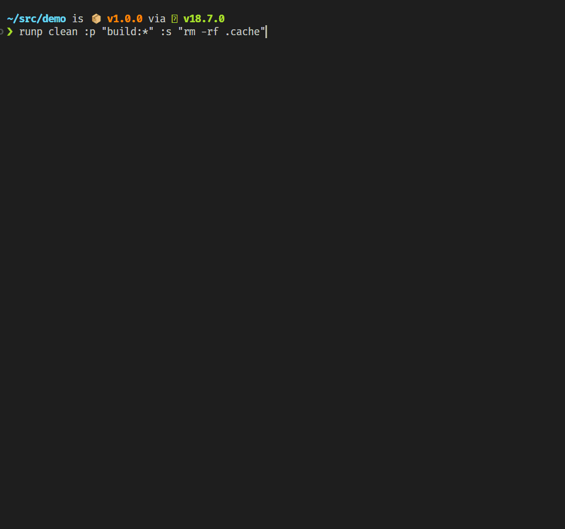

# runp - Neat parallel task execution

[](https://www.npmjs.com/package/@schummar/runp)


## Features

- Run commands in parallel, in series or any combination
- Reference npm scripts by name with glob support
- Command outputs will be separated in their own blocks instead of all mixed together
- Nested `runp` calls will be merged with indented sub commands
- CLI and type-safe Node API

[Try it on StackBlitz](https://stackblitz.com/edit/runp-demo?file=package.json)



# Getting started

## Install

```bash
npm i @schummar/runp
```

## Execute commands

```bash
runp clean :p "build:*" :s "rm -rf .cache"
```

Assuming the following `package.json`:

```json
{
  "scripts": {
    "clean": "rimraf dist",
    "build:esm": "some build command",
    "build:cjs": "another build command",
    "build:type": "tsc --emitDeclarationOnly"
  }
}
```

Each parameter can be a program, npm script, a flag or a switch. Arguments for programs and scripts can be added by encapsulating them in quotes.

- `clean` executes `npm run clean`

- `:p` for "parallel": remaining commands will be executed after the previous and in parallel

- `"build:*"` executes all script matching this glob (see [minimatch](https://github.com/isaacs/minimatch))  
  Mind the quotes, otherwise your shell will try to resolve the wildcard!

- `:s` for "serial": remaining commands will be execute after the previous and in series

- `"rm -rf .cache"` deletes the .cache folder

# Options

```
❯ runp --help
runp v1.5.0

Usage:
  runp [flags...] <commands...>

Flags:
  -f, --forever                       Task will run forever. It won't display a spinner but a different symbol instead
  -h, --help                          Show help
  -k, --keep-output                   Keep output of successful commands visible
  -n, --output-length <number>        Maximum number of lines for each command output (default: 10)
      --version                       Show version
```

Options can either be used as flags (prefix "-") or switches (prefix ":"). Flags generally apply to all commands while switches can be used to change behavior midway for the remaining commands.

## Option: Forever

**Flags** `-f`, `--forever` apply to all commands

**Switches** `:f`, `:f=false` apply for all remaining commands

You might run commands in parallel that are supposed to run indefinitely, like a backend server and a frontend dev server. In this case instead of a spinner, `runp` can display an arrow icons instead. The effect is purely cosmetic:



## Option: Keep output

**Flag** `-k`, `--keep-output` apply to all commands

**Switches** `:k`, `:k=false` apply to remaining commands

Usually a command's output will disappear after is has successfully executed. When `--keep-output` is set, it will remain visible.

## Option: Output length

**Flags** `-n <number>`, `--output-length <number>` apply to all commands

**Switches** `:n=<number>` apply to remaining commands

Defines how many lines of output will be visible at maximum for each command.

## Option: Parallel and serial execution

**Switches** `:p`, `:s` apply to remaining commands

Commands after the `:p` switch will first wait for all commands before the switch to finish, then execute in parallel.

Commands after the `:s` switch will first wait for all commands before the switch to finish, then execute in series.

Both apply to all commands until another `:p` or `:s` appears.

It's possible to have multiple `:p` switches in succession, forming multiple parallel blocks.
For example `runp :p task1 task2 :p task3 task4` will execute first task1 and task2 in parallel, then task3 and task4 in parallel.

Before the first `:p` or `:s` switch appears, all commands will be executed in parallel by default.

## Combining switches

Flags and switches can be combined. E.g. `-fk` or `:pfn=10k=false`

# Error handling

When an error occurs the command will be marked with a red x-symbol and the command output will remain visible.
Any parallel tasks are allowed to continue but dependent commands will not be executed.



# Nested execution

When `runp` is executed as child process of another `runp` instance, it delegates its tasks to the parent instance.
Commands will be shown as child commands to the parent instance's command.

That is useful for example for composing npm scripts.
Say we have the following `package.json`:

```json
{
  "scripts": {
    "lint": "eslint",
    "clean": "rimraf dist",
    "build": "build:*",
    "build:esm": "some build command",
    "build:cjs": "another build command",
    "build:type": "tsc --emitDeclarationOnly",
    "prepublishOnly": "runp :s lint build"
  }
}
```

Running `npm publish` will now execute the `prepublishOnly` script, which in turn has `runp` execute the `lint` and `build` scripts.
The `build` script executes another instance of `runp` with its `build:*` commands.
The output however looks seamless:


# Node API

```ts
import { runp } from '@schummar/runp';

runp({
  keepOutput: true,
  outputLength: 10,

  commands: [
    {
      cmd: 'clean',
      name: 'Clean',
      keepOutput: false,
    },

    ':p',

    {
      cmd: 'build:*',
      cwd: 'src',
    },

    ':s',

    {
      cmd: 'rm',
      args: ['-rf', '.cache'],
    },
  ],
});
```

The Node API allows running `runp` programmatically with all the same options, plus a bit more fine grained control.

## commands.cmd

The executable or npm script to run.

## commands.args

Arguments to pass to executable or npm script.

## commands.cwd

Execute command in different working directory

## commands.id

Give a task an id that can be referenced as dependency.

## commands.depdendsOn

Command will only start once all dependencies have finished.
